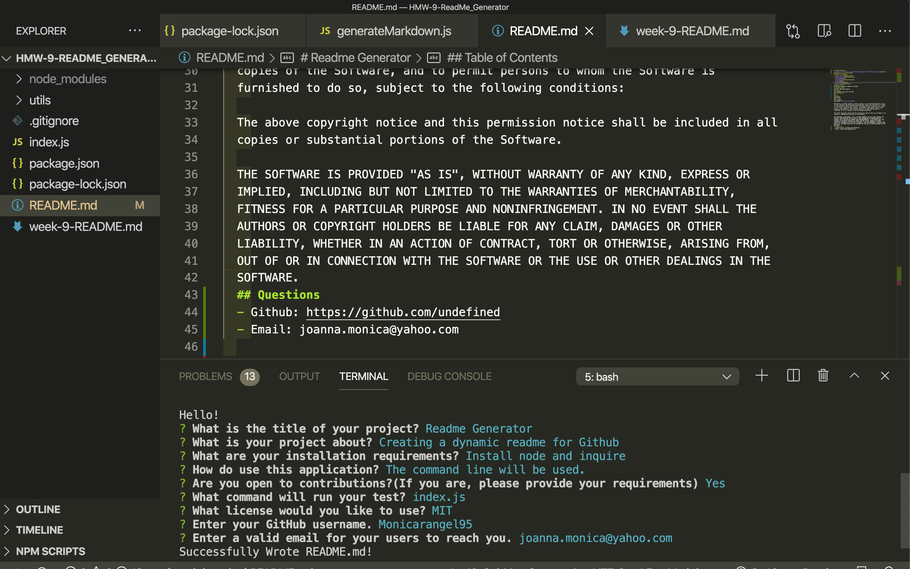

  # Readme Generator
  [](https://opensource.org/licenses/MIT)
  ## Table of Contents
  - [Description](#description)
  - [Installation](#installation)
  - [Usage](#usage)
  - [Contribution](#contribution)
  - [Test](#test)
  - [License](#license)
  - [Questions](#questions)
  ## Description
  Creating a dynamic ReadMe generator for Github Users. A demo picture and video is shown below.

  ## Usage
Install node js and run the code "node index.js" in the command line. 

  

https://drive.google.com/file/d/1sI9u_uI8EvEkiUf95Bs-Sx6zVyOK9uCq/view 

  ## Installation
  Install node and requires a command line.
  ## Usage
  The command line will be used.
  ## Contribution
  Yes
  ## Test
   Insert this code to run test.
 ```
 npm run test
  ```
  ## License
  MIT License
  Copyright (c) [year] [fullname]
  
  Permission is hereby granted, free of charge, to any person obtaining a copy
  of this software and associated documentation files (the "Software"), to deal
  in the Software without restriction, including without limitation the rights
  to use, copy, modify, merge, publish, distribute, sublicense, and/or sell
  copies of the Software, and to permit persons to whom the Software is
  furnished to do so, subject to the following conditions:
  
  The above copyright notice and this permission notice shall be included in all
  copies or substantial portions of the Software.
  
  THE SOFTWARE IS PROVIDED "AS IS", WITHOUT WARRANTY OF ANY KIND, EXPRESS OR
  IMPLIED, INCLUDING BUT NOT LIMITED TO THE WARRANTIES OF MERCHANTABILITY,
  FITNESS FOR A PARTICULAR PURPOSE AND NONINFRINGEMENT. IN NO EVENT SHALL THE
  AUTHORS OR COPYRIGHT HOLDERS BE LIABLE FOR ANY CLAIM, DAMAGES OR OTHER
  LIABILITY, WHETHER IN AN ACTION OF CONTRACT, TORT OR OTHERWISE, ARISING FROM,
  OUT OF OR IN CONNECTION WITH THE SOFTWARE OR THE USE OR OTHER DEALINGS IN THE
  SOFTWARE.
  ## Questions
  - Github: https://github.com/Monicarangel95
  - Email: joanna.monica@yahoo.com
  